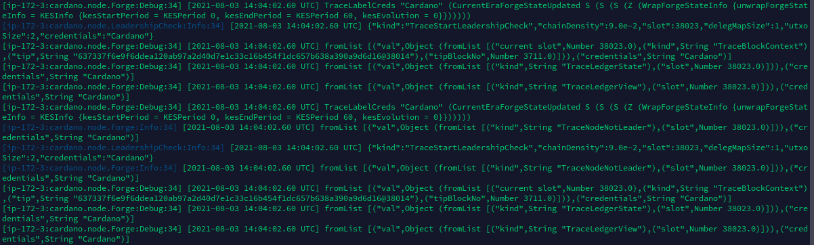

 
  

<h1 align="center"> Private Test Chain </h1>
<h3 align="center"> A Test Chain For Inhouse Projects And Testing </h3>  

 

 
  

<!-- TABLE OF CONTENTS -->
<h2 id="table-of-contents"> :book: Table of Contents</h2>

  
Table of Contents

  <ol>
    <li><a href="#about-the-project"> ➤ About The Project</a></li>
     <li><a href="#overview"> ➤ Overview</a></li>
    <li><a href="#prerequisites"> ➤ Prerequisites</a></li>
     <li><a href="#project-files-description"> ➤ Project Files Description</a></li>
      <li><a href="#getting-started"> ➤ Getting Started</a>
        <ul>
         <li><a href="#node-already-installed">Node Already Installed</a></li>
         <li><a href="#starting-from-scratch">Starting From Scratch</a></li>
        </ul>
       </li>
    <li><a href="#starting-the-nodes"> ➤ Starting The Nodes</a></li>
    <li><a href="#updating-to-alonzo"> ➤ Updating To Alonzo</a></li>
    <li><a href="#results"> ➤ Results</a></li>
    <li><a href="#references"> ➤ References</a></li>
  </ol>

<!-- ABOUT THE PROJECT -->
<h2 id="about-the-project"> :pencil: About The Project</h2>

 
 This project aims to create a private chain based on the updated Cardano ecosystem for purposes of testing and building client projects. The private chain is meant to mimic the current Cardano chain. 
 This repository is created directly using scripts from IOHK with a few modifications for ease of creation and to fix a few bugs that have not been updated by IOHK as of this writing.

<!-- OVERVIEW -->
<h2 id="overview"> :pencil: Overview</h2>

 
 The aim of this repository is to get a chain running that is updated to the current Cardano version.  

 <b>- This chain is still a work in process - It is not updating past Mary. There is an error after the update from Mary to Alonzo is called in the 4th update. There are two bug issues currently open with IOHK at the cardano node github, <a href="https://github.com/input-output-hk/cardano-node/issues/2971)">2971</a> and <a href="https://github.com/input-output-hk/cardano-node/issues/2972)">2972</a></b>

<b><a href="https://github.com/input-output-hk/cardano-node/issues/2971">- [2971]</a> - This is an issue with the wrong amount of lovelace being processed in 3 of the updates. I was able to fix / get it to work, but I am hoping to get an answer from IOHK as to why it didn't work and if my fix was correct  

<a href="https://github.com/input-output-hk/cardano-node/issues/2972">- [2972]</a> - This is because the upgrade to Alonzo from Mary is failing - There is also a command within the update that references a file that was not created / doesn't exist. I have not been able to fix this on my own and have not be able to get any help from IOHK as of this writing. </b>  

 
The blockchain is built by running a series of (slightly modified) scripts from IOHK. IOHK allows you to build the chain in different ways. The way we choose to build the chain is by first starting a Byron network and then calling a series of 4 updates that will bring the system from Byron to Alonzo (although there is still an error getting all the way to Alonzo). Along with moving the blockchain through to Alonzo, the scripts also transfer ada to a Shelly wallet / node for use with block production and creates a block producing node. 

<!-- PREREQUISITES -->
<h2 id="prerequisites"> :fork_and_knife: Prerequisites</h2>

Everything needed to run a Cardano node and the node:

<a href="https://github.com/input-output-hk/cardano-node">Cardano Node and Cardano CLI</a> 
- cabal 3.4.0.0 
- ghc 8.10.4

If you need to build from scratch, you can follow the directions that I use to build the node on an AWS instance <a href="#starting-from-scratch">here</a>    

<!-- FILE DESCRIPTION -->
<h2 id="project-files-description"> :dart: Project File Description</h2>

 
<b> These scripts from IOHK had a few bugs and have been modified a small amount - please see the original scripts <a href="https://github.com/input-output-hk/cardano-node/tree/master/scripts/byron-to-alonzo">here</a>.</b>
Included in these scripts that we use to get the chain going and to progress through Byron to Alonzo are a starter script to build everything and then 4 update scripts to update to Alonzo among other things:
<ol>
  <li>
    
 
      mkfiles.sh - This script sets up a cluster that starts out in <b>Byron</b>, and can transition to <b>Alonzo</b>. The script generates all the files needed for the setup, and prints commands (to be run manually to start the nodes, post transactions, etc.). This script can also be updated to change the number of nodes that are created and other settings of the blockchain (epoch time, kes time, etc)
    

  </li>
  <li>
    
 
      update-1.sh - The first update moves funds from a <b>Byron</b> address so that they can be used in the <b>Shelly</b> upgrade and initiates the transition to protocol version 1.
    

  </li>
  <li>
    
 
      update-3.sh - The next update transitions to protocol version 3 - <b>Allegra</b>. It also sets up a working stakepool (the update to version 2 happens automatically with the way the process was started, we do not need to use update-2.sh - Please see #2 in the comments for mkfiles.sh for more information).
    

  </li>
  <li>
    
 
      update-4.sh - The third update transitions to protocol version 4 - <b>Mary</b>
    

  </li>
  <li>
    
 
      update-5.sh - The fourth update transitions to protocol version 5 -<b>Alonzo</b>. <B>The Alonzo update is currently not working. </B>
    

  </li>
</ol>

<!-- GETTING STARTED -->
<h2 id="getting-started"> :hammer: Getting Started</h2>

 
  There are two ways to get started. If you already have a Cardano Node then all you should be able to just fix a few variables. If you are starting fresh, I have included everything you need to start a node from scratch.    

<h2 align="center"> Node Already Installed </h2>

<!-- NODE INSTALLED -->
<h2 id="node-already-installed"> :diamond_shape_with_a_dot_inside: Node installed</h2>

 
  If you already have a node installed, you will need checkout the current Cardano Alonzo node version (currently white version 1.1) and adjust some of your variables like the node socket, etc. If you look at the update scripts, you will see that it needs to be set to the node-pool1/node.sock (if you keep the variables set as is) - there may be some other small changes depending on your setup.    

<h2 align="center"> Starting From Scratch </h2>

<!-- STARTING FROM SCRATCH -->
<h2 id="starting-from-scratch"> :large_orange_diamond: Starting From Scratch</h2>

 
  The code below should get you a working node on a clean Linux Ubuntu machine. I used it on AWS instances with Ubuntu 20.04.  
  The Cardano Node version it pulls down from IOHK is Alonzo White 1.1 
  <b>These instructions are, In large part, courtesy of the  <a href="https://www.coincashew.com/coins/overview-ada/guide-how-to-build-a-haskell-stakepool-node">Coincashew</a> guide on setting up a node with changes in order to pull the Cardano Alonzo White Node.</b>

<pre>
<code>
sudo apt-get update -y

sudo apt-get upgrade -y

sudo apt-get install git jq bc make automake rsync htop curl build-essential pkg-config libffi-dev libgmp-dev libssl-dev libtinfo-dev libsystemd-dev zlib1g-dev make g++ wget libncursesw5 libtool autoconf libtinfo5 libncurses-dev -y

mkdir $HOME/git
cd $HOME/git
git clone https://github.com/input-output-hk/libsodium
cd libsodium
git checkout 66f017f1
./autogen.sh
./configure
make
sudo make install

curl --proto '=https' --tlsv1.2 -sSf https://get-ghcup.haskell.org | sh

	Answer YES to automatically add the required PATH variable to ".bashrc".
	Answer NO to installing haskell-language-server (HLS).
	** You do not need to install Stack but I do just to have it **
	
	also, you can restart terminal or source by typing:  `source /home/ubuntu/.ghcup/env`
	
</code>	
	
cd $HOME
source .bashrc
ghcup upgrade
ghcup install cabal 3.4.0.0
ghcup set cabal 3.4.0.0

ghcup install ghc 8.10.4
ghcup set ghc 8.10.4

echo PATH="$HOME/.local/bin:$PATH" >> $HOME/.bashrc
echo export LD_LIBRARY_PATH="/usr/local/lib:$LD_LIBRARY_PATH" >> $HOME/.bashrc
echo export NODE_HOME=$HOME/cardano-my-node >> $HOME/.bashrc
echo export NODE_BUILD_NUM=$(curl https://hydra.iohk.io/job/Cardano/iohk-nix/cardano-deployment/latest-finished/download/1/index.html | grep -e "build" | sed 's/.*build\/\([0-9]*\)\/download.*/\1/g') >> $HOME/.bashrc
source $HOME/.bashrc
	
cabal update
cabal --version
ghc --version

cd $HOME/git
git clone https://github.com/input-output-hk/cardano-node.git
cd cardano-node
git fetch --all --recurse-submodules --tags
git checkout acefba14ef54235ab43105b421754065152da165

cabal configure -O0 -w ghc-8.10.4

echo -e "package cardano-crypto-praos\n flags: -external-libsodium-vrf" > cabal.project.local
sed -i $HOME/.cabal/config -e "s/overwrite-policy:/overwrite-policy: always/g"
rm -rf $HOME/git/cardano-node/dist-newstyle/build/x86_64-linux/ghc-8.10.4

cabal build cardano-cli cardano-node

sudo cp $(find $HOME/git/cardano-node/dist-newstyle/build -type f -name "cardano-cli") /usr/local/bin/cardano-cli
sudo cp $(find $HOME/git/cardano-node/dist-newstyle/build -type f -name "cardano-node") /usr/local/bin/cardano-node

cardano-node version
cardano-cli version

mkdir $NODE_HOME
cd $NODE_HOME

git clone https://github.com/stackBlock/cardano-private-network
cd cardano-private-network

echo export CARDANO_NODE_SOCKET_PATH="$NODE_HOME/cardano-private-network/example/node-bft1/node.sock" >> $HOME/.bashrc
source $HOME/.bashrc

</code>
</pre>

<!-- TOPOLOGICAL FEATURE -->
<h2 id="starting-the-nodes"> :large_blue_diamond: Starting The Nodes</h2>

 
  The <code>mkfiles.sh</code> file is configured to create all the files and nodes that you need to start up the blockchain in the Byron era.  
  In order to build all the files you need to run the <code>mkfiles.sh</code>  
  
 <code>
 ./mkfiles.sh
 </code>  
 
 After the mkfiles.sh runs, it will create a directory called <code>example </code>.
  
  cd into <code>example</code> and then into the <code>run</code> directory.  
  
  Once in the <code>run</code> directory you have a few options. You can run <code>all.sh</code> in order to start all the nodes.  
  
  <code>./all.sh</code>  
  
  Or you can start the individual nodes in different terminals.   
  

<!-- UPDATING TO ALONZO -->
<h2 id="updating-to-alonzo"> :mag: Updating To Alonzo</h2>

  After all the nodes are started, we have to just run through the updates in order to bring the node into the Alonzo era. 

<ul>
  <li>
    Immediately after  the nodes have been started, I check to see that everything is running properly by calling:  
    
<code>cardano-cli query tip --testnet-magic 42</code>  

this should give information on the chain and if all looks good, you should be in the <b>Byron</b> era:   

<pre>
<code>
{
    "epoch": 0,
    "hash": "1d3c5ee3265e2aef1a4e8a94b95638257244ccd0b3b015c634599b5cacc8b1be",
    "slot": 61,
    "block": 62,
    "era": "Byron"
}
</code>
</pre>  

Now  you can run the first update:  

<code>./update-1.sh</code>  

This script will:  
- move funds out of the Byron genesis address, so that we can use them later in Shelley 
- initiate the transition to protocol version 1 (Byron, OBFT)  

Wait a few epochs and check query the tip again - You should now be in the <b>Shelly</b> era:  

 <pre>
<code>
{
    "epoch": 3,
    "hash": "6860b93ac8da95df813fda583cb46335652073955be2eb9465cdc48ed113a706",
    "slot": 2128,
    "block": 336,
    "era": "Shelley"
}
</code>
</pre>  

  </li>
  <li>
    Next we will be running <code>update-3.sh</code>. We are skipping the update-2 because the way the node was started with, <code>mkfiles.sh</code> it will automatically switch to version 2 after the initial update (See the comments in <code>mkfiles.sh</code> for more information). 
This update needs to be run with the current epoch as a variable (find the epoch by running a query tip & Sometimes you need to choose the next era for it to work...):  
    
<code>./update-3.sh (epoch)</code>  

This script will:  
- This script will initiate the transition to protocol version 3 (Allegra). 
- It will also set up a working stake pool (including delegating to it).  

After we run this update, we need to <b>restart the nodes</b> and wait an epoch or two, and you will see that we are in the <b>Allegra</b> era:  

 <pre>
<code>
{
    "epoch": 7,
    "hash": "e7fd2e60d0cbfd46611ef6847ea1a3f40404852736133c58f9b74de8058aeffe",
    "slot": 9142,
    "block": 819,
    "era": "Allegra"
}
</code>
</pre>  

  </li>
  <li>
    Now we will be running <code>update-4.sh</code>. This update will bring us into the Mary era 
This update needs to be run with the current epoch as a variable (find the epoch by running a query tip & Sometimes you need to choose the next era for it to work...):  
    
<code>./update-4.sh (epoch)</code>  

This script will:  
- This script will initiate the transition to protocol version 4 (Mary)  

After we run this update, we need to <b>restart the nodes</b> and wait an epoch or two, and you will see that we are in the <b>Mary</b> era:  

 <pre>
<code>
{
    "epoch": 12,
    "hash": "23397e47940238d75834865dc8abadd5f28e8c138cf2d60f1cad384d05d696da",
    "slot": 15371,
    "block": 1427,
    "era": "Mary"
}
</code>
</pre>  
  </li>
  <li>
    <b>*** THIS IS CURRENTLY NOT WORKING - PLEASE SEE <a href="https://github.com/input-output-hk/cardano-node/issues/2972">[2972]</a> ***</b>   Now we will be running <code>update-5.sh</code>. This update will bring us into the Alonzo era 
This update needs to be run with the current epoch as a variable (find the epoch by running a query tip & Sometimes you need to choose the next era for it to work...):  
    
<code>./update-4.sh (epoch)</code>  

This script will:  
- This script will initiate the transition to protocol version 5 (Alonzo).  

After we run this update, we need to <b>restart the nodes</b> and wait an epoch or two, and you will see that we are in the <b>Alonzo</b> era:  

 <pre>
<code>
{

}
</code>
</pre>  
  </li>
</ul>

<!-- RESULTS  -->
<h2 id="results"> :mag: Results</h2>

  This process should start a working Cardano Blockchain, including a block producing node.  We should be able to start nodes on other machines and connect into the chain.  As soon as the Alonzo updates are complete, this chain will support smart contract development and testing (prior to running contracts on the mainnet).  We hope to package this for our clients as a safe way for them to build their businesses and ensure that everything is functional before the move to the main Cardano chain.   

<!-- REFERENCES -->
<h2 id="references"> :books: References</h2>

<ul>
  <li>
    

          <a href="https://github.com/input-output-hk/cardano-node">cardano-node/</a>
    

  </li>
  <li>
    

      <a href="https://github.com/input-output-hk/cardano-node/tree/master/scripts/byron-to-alonzo">cardano-node/scripts/byron-to-alonzo/</a>
    

  </li>
  <li>
    

      <a href="https://www.coincashew.com/coins/overview-ada/guide-how-to-build-a-haskell-stakepool-node">Guide: How to build a Cardano Stake Pool</a>
    

  </li>
</ul>
